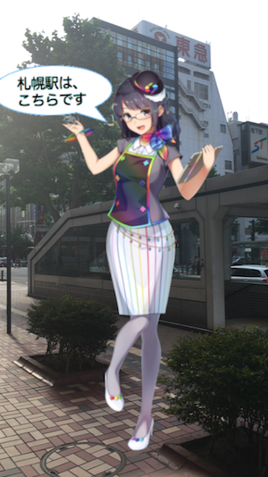
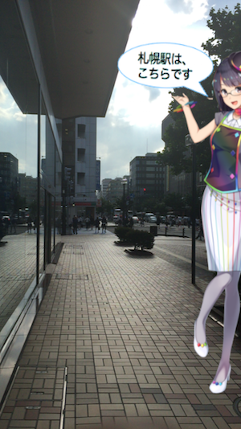

## Overview

 いつでも札幌駅の方向を優しく教えてくれる、めそ子さん

(OpenGLによるARアプリのサンプルです)

お酒を飲んでお店を出た時、どっちに向かって歩けばいいのか全く分からない、超方向音痴な私は、いつも聞いてしまいます。「札幌駅はどっち？」 そんな私のために、札幌駅の方向を優しく教えてくれる、めそ子さん作りました。
札幌駅の方向さえ分かれば、だいたい何とかなる「札幌あるある」案件です。




作成方法の記事は、こちらです。

<br>[OpenGLによるARアプリ 〜いつでも札幌駅の方向を優しく教えてくれる、めそ子さんを作ってみた〜](http://dev.classmethod.jp/smartphone/opengl_ar/)


## Compile

Xcode 7.3.1

```
$ git clone https://github.com/furuya02/ARSample
$ cd ARSample
$ xcode ARSample.xcodeproj
```

## Licence

MIT

